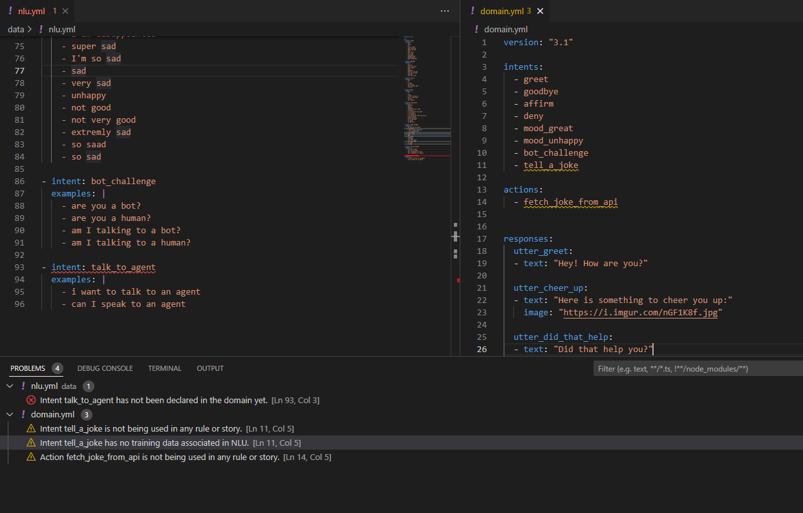

# RASACode

RASACode is a VSCode extension designed to make creating RASA projects easier. It is currently in a very early beta, so bug reports and feature requests are very much welcome.

RASACode requires initialization to run. In the root directory of your RASA project, open the **RASACode** panel from the activity bar and click on "Initialize RASACode". Alternatively, you can initialize RASACode through the command palette.

## Features

#### Real-time Error Checking

RASACode checks your project for RASA-related errors in the domain and training data. 

#### Quick Access to all Project Elements

RASACode also prepares and maintains an easy-to-access project tree that lets you view and jump to the elements of your project at a glance.

## Requirements

While RASACode runs on its own, it does not provide syntax highlighting for YML files. Installing a YML linter is highly recommended.

## Extension Settings

Every error and warning currently available in RASACode can be turned on or off based on your preferences. Please check the RASACode extension settings to learn more.

## Release Notes

### 0.1

Initial early public beta release.
